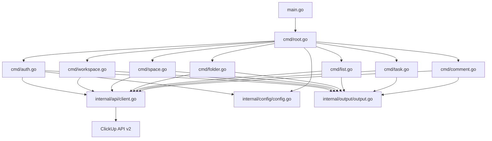

# Architecture

## Overview

## Layers

1. **cmd/** — Cobra command definitions, flag parsing, validation
2. **internal/api/** — HTTP client, API type definitions, request/response handling
3. **internal/config/** — Viper-based config file management
4. **internal/output/** — JSON output formatting, error formatting

## Design Principles

- JSON-first output for AI agent consumption
- Consistent error format across all commands
- Config file for persistent auth, flag overrides for one-off usage
- Thin command layer — business logic lives in api package
